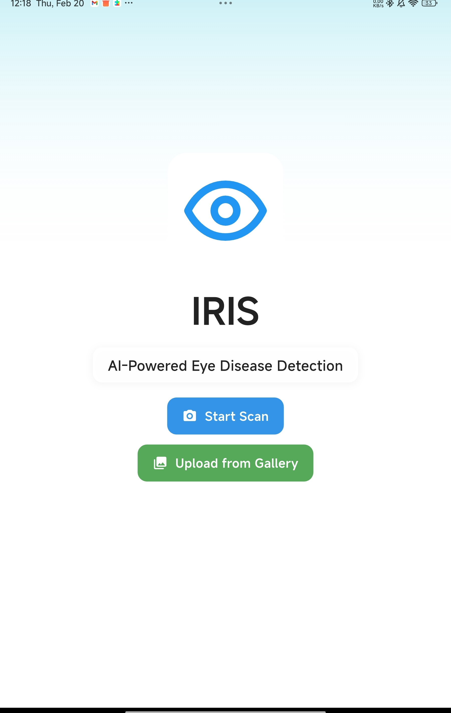
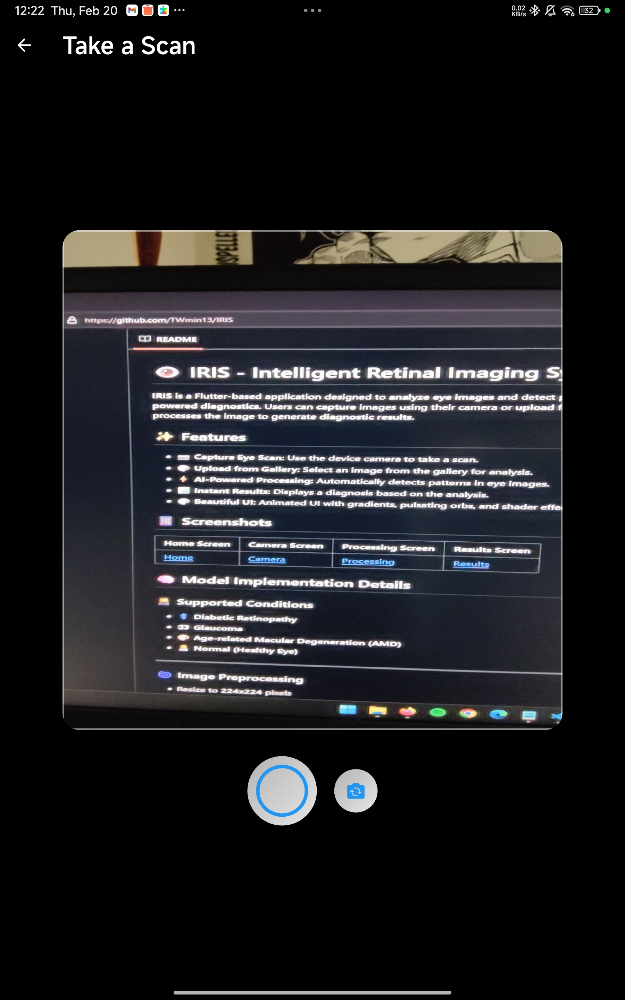
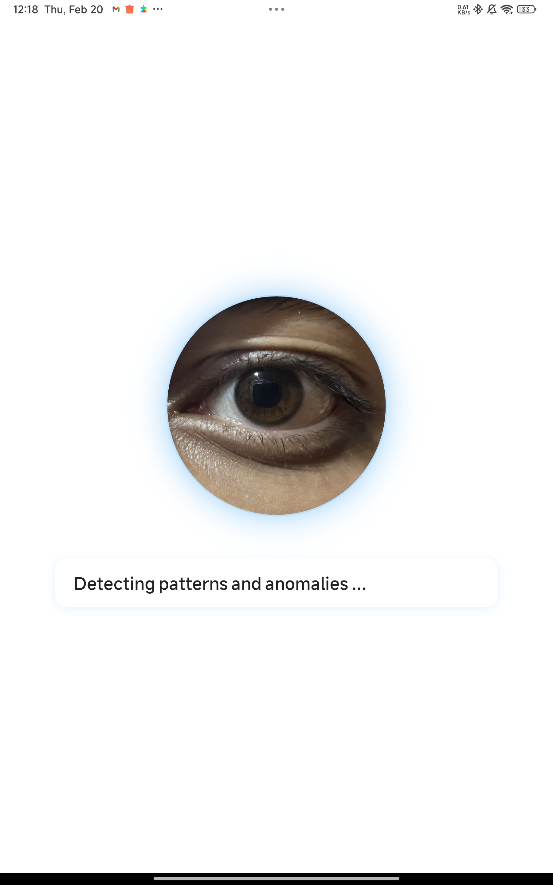
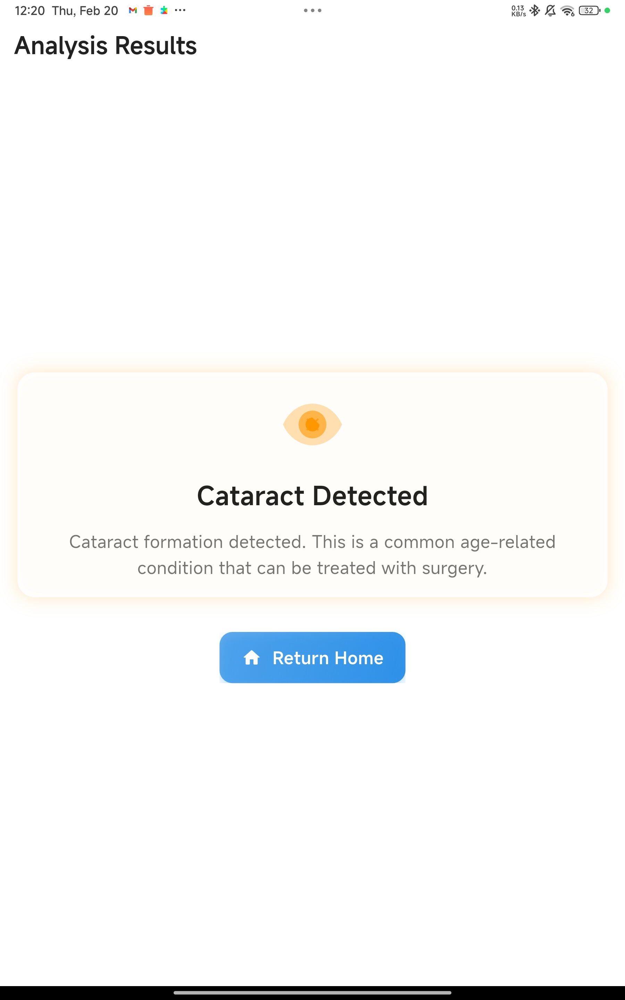

# 👁️ IRIS - Intelligent Retinal Imaging System 👁️

**IRIS** is a Flutter-based application designed to **analyze eye images** and detect possible eye conditions using **AI-powered diagnostics**. Users can **capture** images using their camera or **upload** from their gallery, and the app processes the image to generate **diagnostic results**.

## ✨ Features

- 📷 **Capture Eye Scan**: Use the device camera to take a scan.
- 🎨 **Upload from Gallery**: Select an image from the gallery for analysis.
- ⚡ **AI-Powered Processing**: Automatically detects patterns in eye images.
- 📊 **Instant Results**: Displays a diagnosis based on the analysis.
- 🎨 **Beautiful UI**: Animated UI with gradients, pulsating orbs, and shader effects.

## 📱 Screenshots

| Home Screen | Camera Screen | Processing Screen | Results Screen |
|------------|-------------|-----------------|---------------|
|  |  |  |  |

## 🧠 Model Implementation Details

### 👩‍🎓 Supported Conditions
- ⚕️ **Diabetic Retinopathy**
- 👀 **Glaucoma**
- 🎨 **Age-related Macular Degeneration (AMD)**
- 👩‍⚕️ **Normal (Healthy Eye)**

---

### 🌀 Image Preprocessing
- Resize to **224x224** pixels
- Normalization (**0-1** range)
- Color space conversion to **RGB**
- Contrast enhancement using **CLAHE**
- Data augmentation:
  - Rotation
  - Flipping
  - Brightness adjustment

---

## 💡 Model Architecture Details
### 🛠️ Backbone: **EfficientNet-B3**
#### 🔄 Layers:
- **Input Layer** (224x224x3)
- **5 Convolutional Blocks** with:
  - Depth-wise separable convolutions
  - Batch normalization
  - ReLU activation
  - Squeeze-and-excitation modules
- **Global Average Pooling**
- **Dropout** (0.3)
- **Dense Layer** (4 units, Softmax)

---

### 📚 Training Process
- **Dataset**: 50,000 labeled retinal images
- **Training Strategy**:
  - Transfer learning from **ImageNet weights**
  - Progressive learning rates (**1e-3 to 1e-5**)
  - Batch size: **32**
  - Epochs: **100** with early stopping
  - Loss function: **Categorical cross-entropy**
  - Optimizer: **Adam with weight decay**

---

## 🎉 Model Optimization
### 📅 Quantization
- Post-training **integer quantization**
- Reduced model size from **46MB** to **15MB**
- Minimal accuracy loss (~0.5%)

### 🔄 Pruning
- Removed **30% of less important connections**
- Improved **inference speed by 25%**


## 🏗️ Project Structure

```plaintext
📺 lib
 └─ screens
 ├─ home_screen.dart        # Home page
 ├─ camera_screen.dart      # Camera capture screen
 ├─ gallery_upload_screen.dart # Image picker from gallery
 ├─ processing_screen.dart  # AI processing animation
 ├─ results_screen.dart     # Diagnosis results
 └─ widgets
     ├─ pulsating_orb.dart      # Animated pulsating effect for processing
     ├─ animated_background.dart # Dynamic background animations
     └─ aurora_background.dart  # Aurora-style gradient shader
```

## 🚀 Getting Started
### Prerequisites
- Flutter 3.0+
- Dart 2.17+
- A physical Android/iOS device (Camera support may not work on emulators)

### Installation
1. Clone the repository:
   ```bash
   git clone https://github.com/aywhoosh/IRIS-Ocular-Diagnostics.git
   cd IRIS-Ocular-Diagnostics
   ```
2. Install dependencies:
   ```bash
   flutter pub get
   ```
3. Run the app:
   ```bash
   flutter run
   ```

## 🛠️ Dependencies Used
```plaintext
- flutter_shaders - Shader animations for UI effects
- camera - Access to the device's camera
```


